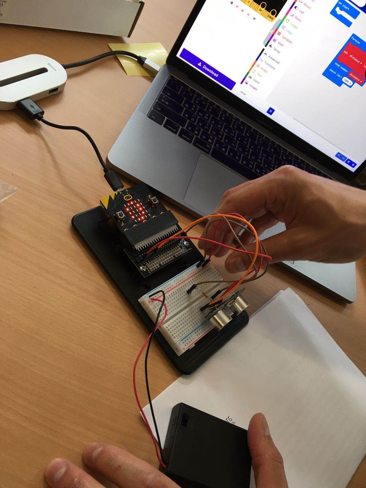
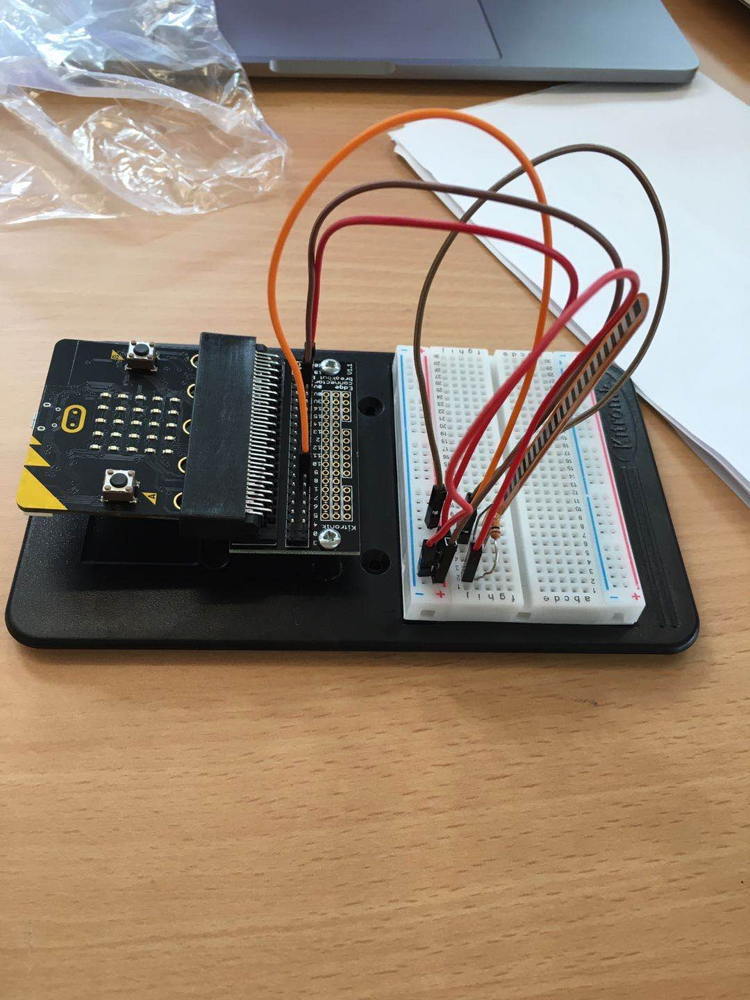
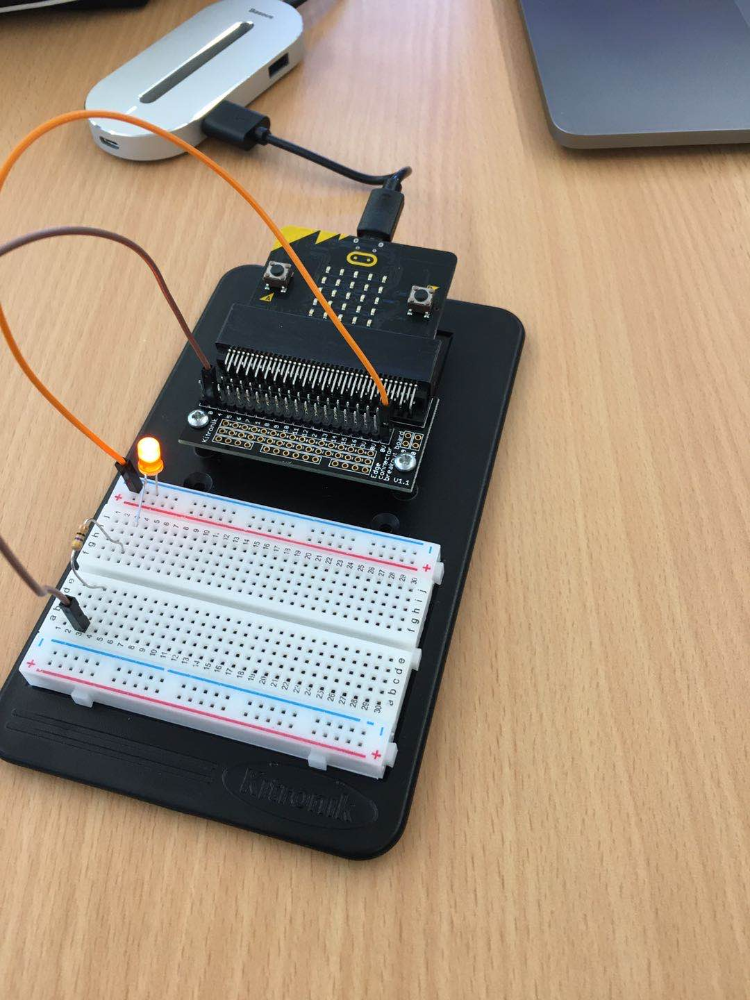

# Inventor Kit Experiments

### Experiment name ###

Ultrasonic Scensor Experiment

#### Photo of completed project ####

This experiment was done in class, by connecting the ultrasonic scensor with the microbit, we would be able to detect the distance with the ultrasonic scensor and the numbers on the microbit screen would change as the scensor feels something approaching or within its scensor redius.

#### Reflection ####

In this experiment, everything was new to me as i have never done coding before and have never touched microbit in my life, this experiment was definitly interesting and challenging, connecting the ultrasonic scensor with microbit isn't as easy as it looks and sound, as an simple miss connection between the microbit and the scensor could make the whole experiment end in a failure.

Unfortunately this experiment ended as a failure, but after all it is an experiment, and what is important is what have we learned from the experiment and the mistakes we have made. After some assistant from the course tutor, we were still unable to figure out what was done wrong on the moment as everything was connected to where it is supose to be (that was what we thought at the time), by looking at the tutorial for this experiment, we have found nothing at the moment, but after a few days of looking at it, the course tutor have came up with the solution and answer of why this experiment didn't work for us. 

For many experiments to work, it is important for us to make and complete a electricity circuit, it is like completeing a circle, and if we dont connect the end of a circle (start point and finish point)the circle would not be completed, where anything in the middle will not be connected as well, and this is the same as electricity circuits, in our experiment we didn't connect the ultrasonic scensor to the GND, where this cause the whole electricity circuit to fail as it didn't form a "circle", and this was what went wrong in our experiment and what I have learned from it.

This experiment could be the basis of a real world application such as an auto driving car, the ultrasonic scensor can be a scensor that triggers the car to stop when it is too close to other cars or things on the road, the future is limitless as this technology can be more advance than now or it could already be used in auto driving cars that are still under development.

### Experiment name ###

Microbit Flex Scensor

#### Photo of completed project ####

A final completion of the expermient done

#### Reflection ####

In this experiment, something new to me was or something I learned was the coding and also the building of this experiment. As I am new to the Microbit world, I dont know much about the variety of the equipments and what are they, in this experiment I have discovered something i have never seen before, and that is the Flex sensor, the Flex sensor measures resistance on its flex, and it only sensors the resistance when it is bend from the opposite direction of where the lines are at the top. 

Even though this experiemnt ended in a failure, but we soon found out it was the problem with the coding and fixed it right away, it was still fun building the exoeriemtn and actually learning something that I have never seen before.

This experiment could be the basis of a real world application such as a robotic hand, a robtic hand is actually all around the internet, and most of them are using the flex sensor, with this technology people are able to tocuh smoething and control them without having rally to have contect with them, and with the advance of technology, it is not hard to believe that in the future, we would be able to move something that is in a different country with a robotic glove (flex sensor).

### Experiment name ###

LED experiment

#### Photo of completed project ####

A completetion caption of the experiment

#### Reflection ####

In this experiment, something new to me was or something I learned was creating a electrical circuit for the whole experiment to work. Learning my mistakes from the previous experiment Ultrasonic sensor, I have learned that creating a electrical circuit is really important, and this this experiment, it is really the only thing that can go wrong, after checking and checking that I have built the experiemtn right, I connected with the microbit that has the code inside it and the experiment ended in a success. 

This experiment could be the basis of a real world application such as many different interactive arts, as LED can create different color lights, it is really interesting to see what artist and designers can do with them, even though there are already alot of artist and designers have played with this already, it is still interesting to see what something new could come out from it.

### Experiment name ###

(Replace this with the experiment name)

#### Photo of completed project ####
In the code below, replace imagemissing.jpg with the name of the image, which should be in the kitexperiments folder.

(Insert a caption here)

#### Reflection ####

In this experiment, something new to me was or something I learned was (insert something here).

This experiment could be the basis of a real world application such as (insert something here).

### Experiment name ###

(Replace this with the experiment name)

#### Photo of completed project ####
In the code below, replace imagemissing.jpg with the name of the image, which should be in the kitexperiments folder.

(Insert a caption here)

#### Reflection ####

In this experiment, something new to me was or something I learned was (insert something here).

This experiment could be the basis of a real world application such as (insert something here).

