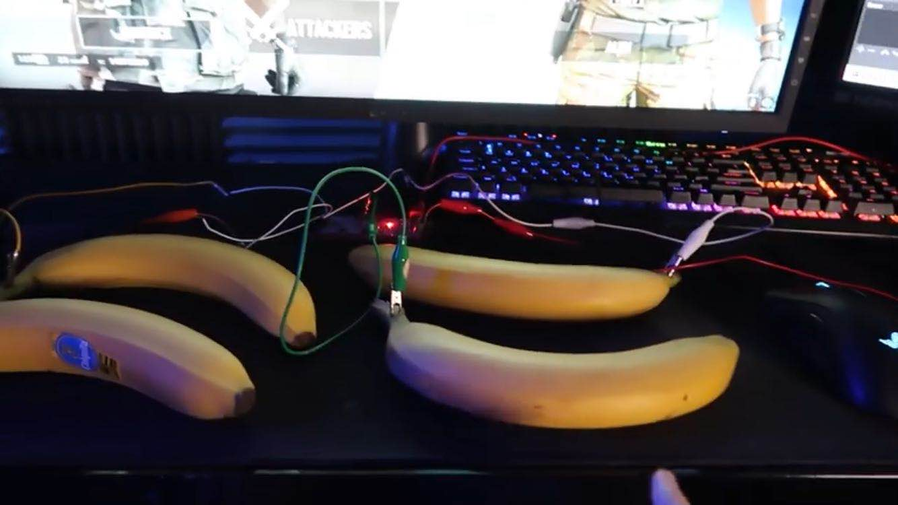
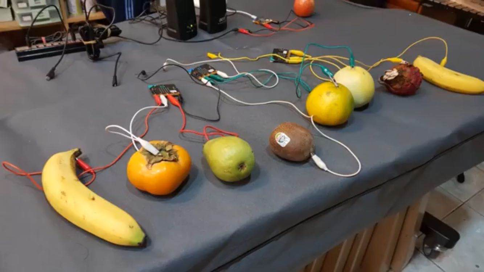
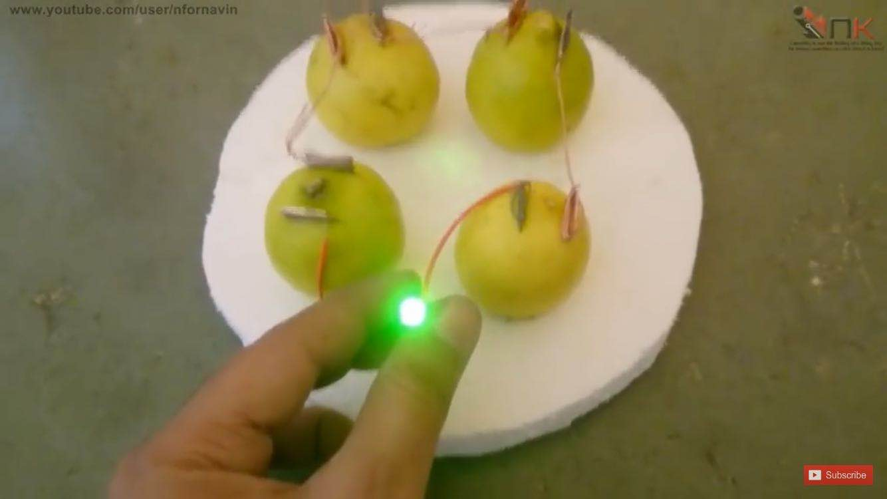
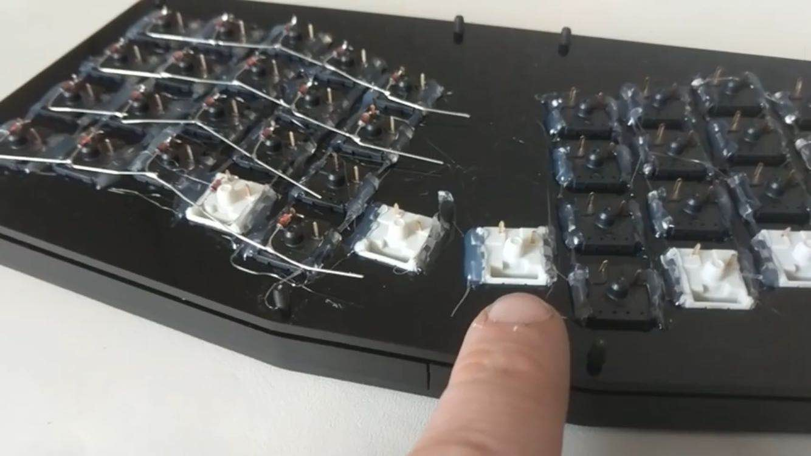
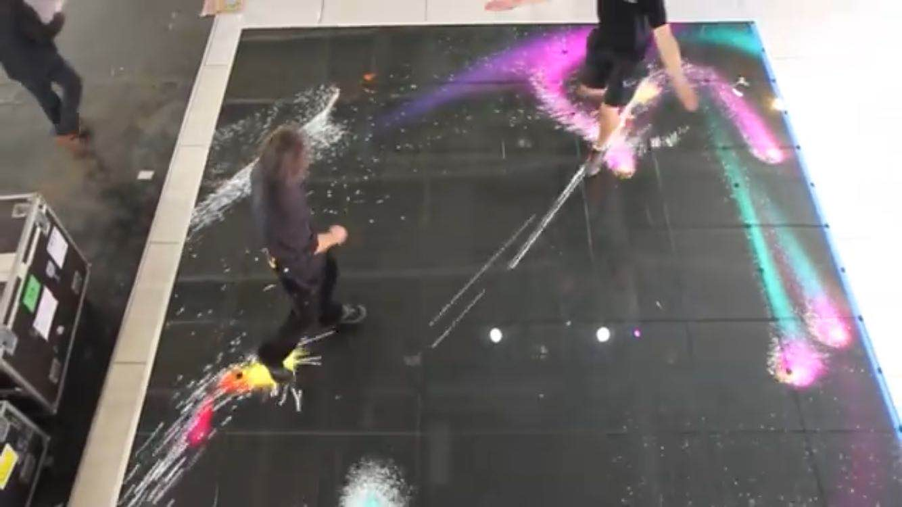
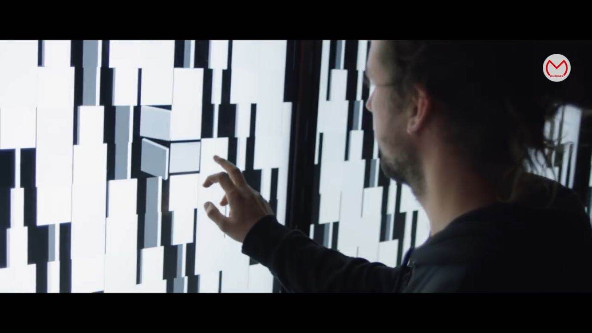

# Assessment 1: Replication project

## Replication project choice ##
The project I have chosen to replicate is the Banana Keyboard

## Related projects ##

### Related project 1 ###
Playing Videogames with a Banana Keyboard

https://www.youtube.com/watch?v=srWDRWrSHZM&t=41s

This project is related to mine because we were both using Banana as our Keyboard but just with different purpose, the concept is the same, but in the video, his is more complicated than my.

### Related project 2 ###
Fruit Keyboard

https://www.youtube.com/watch?v=B2esj9-7RU4

This project is related to mine is becasue we were both using "fruits" as keyboards to make music, but comparing mine to this project, there were more variety of fruits used in the project compared to mine, but the idea and the concept were both the same, both were about using fruits as keyboards to make music.

### Related project 3 ###
Glowing LED with Lemon

https://www.youtube.com/watch?v=AWEdpTOtL6M

The reason this project is realted to my project is because in this project, he is also using "fruit" to create a electrical circuit, but instead using the lemon to become a keyboard and make music with it, this project uses lemon as a source of electricity, and the electricity of four lemon comboned generated enough electricity to successfuly light up the LED.

### Related project 4 ###
Hand Wired Keyboard

https://www.youtube.com/watch?v=zY2k75eWrLQ

This project is realted to mine is becasue the two of our project were basically sharing the same concept, when the key on the keyboard is pressed down, it sends a message to the center in this case the computer, than letters comes out or actions made, and this is the same with my project, as when the banana is pressed, it sends a signal/message to the microbit to trigger the code to make music. The Hand Wired Keyboard project is like a more complicated and professional version of a Banana keyboard, considering the two basically does the samething in sending message to the control center to trigger actions as what they are coded to do.

### Related project 5 ###
Interactive LED Floor

https://www.youtube.com/watch?v=g6N9Qid8Tqs&list=PLUFYSjzJt4pSAkPLRojNrTt6ZOVkDmI2_

This project is related to mine is becasue i believe that we have used the same concept in our projects, with the LED Floor project, the movement of "colors" are triggered when someone steps on it and walks on it, it is technically the same as the Banana Keyboard, as on press music comes out. With the LED Floor, they could be using a motion scensor, touch screen type or the same as the Banana keyboard "on press", therefore when something is detected, it triggers the code to make LED colors to follow the motion. The concept is likly to be the same, but the LED Floor project is definitely more challenging to create and more time consuming. 

### Related project 6 ###
What the Future of Art Will Look Like

https://www.youtube.com/watch?v=ECZbW2jcPcw

This project is related to mine is becasue i believe that we have used the same concept in our projects, with the LED Floor project, the movement of "colors" are triggered when someone steps on it and walks on it, it is technically the same as the Banana Keyboard, as on press music comes out. With the LED Floor, they could be using a motion scensor, touch screen type or the same as the Banana keyboard "on press", therefore when something is detected, it triggers the code to make LED colors to follow the motion. The concept is likly to be the same, but the LED Floor project is definitely more challenging to create and more time consuming. 

## Reading reflections ##
*Reflective reading is an important part of actually making your reading worthwhile. Don't just read the words to understand what they say: read to see how the ideas in the text fit with and potentially change your existing knowledge and maybe even conceptual frameworks. We assume you can basically figure out what the readings mean, but the more important process is to understand how that changes what you think, particularly in the context of your project.*

*For each of the assigned readings, answer the questions below.*

### Reading: Don Norman, The Design of Everyday Things, Chapter 1 (The Psychopathology of Everyday Things) ###

*What I thought before: Describe something that you thought or believed before you read the source that was challenged by the reading.*

*What I learned: Describe what you now know or believe as a result of the reading. Don't just describe the reading: write about what changed in YOUR knowledge.*

*What I would like to know more about: Describe or write a question about something that you would be interested in knowing more about.*

*How this relates to the project I am working on: Describe the connection between the ideas in the reading and one of your current projects or how ideas in the reading could be used to improve your project.*

### Reading: Chapter 1 of Dan Saffer, Microinteractions: Designing with Details, Chapter 1 ###

*What I thought before: Describe something that you thought or believed before you read the source that was challenged by the reading.*

*What I learned: Describe what you now know or believe as a result of the reading. Don't just describe the reading: write about what changed in YOUR knowledge.*

*What I would like to know more about: Describe or write a question about something that you would be interested in knowing more about.*

*How this relates to the project I am working on: Describe the connection between the ideas in the reading and one of your current projects or how ideas in the reading could be used to improve your project.*

### Reading: Scott Sullivan, Prototyping Interactive Objects ###

*What I thought before: Describe something that you thought or believed before you read the source that was challenged by the reading.*

*What I learned: Describe what you now know or believe as a result of the reading. Don't just describe the reading: write about what changed in YOUR knowledge.*

*What I would like to know more about: Describe or write a question about something that you would be interested in knowing more about.*

*How this relates to the project I am working on: Describe the connection between the ideas in the reading and one of your current projects or how ideas in the reading could be used to improve your project.*

## Interaction flowchart ##
*Draw a flowchart of the interaction process in your project. Make sure you think about all the stages of interaction step-by-step. Also make sure that you consider actions a user might take that aren't what you intend in an ideal use case. Insert an image of it below. It might just be a photo of a hand-drawn sketch, not a carefully drawn digital diagram. It just needs to be legible.*

## Process documentation

*In this section, include text and images that represent the development of your project including sources you've found (URLs and written references), choices you've made, sketches you've done, iterations completed, materials you've investigated, and code samples. Use the markdown reference for help in formatting the material.*

*This should have quite a lot of information!*

*There will likely by a dozen or so images of the project under construction. The images should help explain why you've made the choices you've made as well as what you have done. Use the code below to include images, and copy it for each image, updating the information for each.*

*Include screenshots of the code you have used.*

## Project outcome ##

*Complete the following information.*

### Project title ###

### Project description ###

*In a few sentences, describe what the project is and does, who it is for, and a typical use case.*

### Showcase image ###

*Try to capture the image as if it were in a portfolio, sales material, or project proposal. The project isn't likely to be something that finished, but practice making images that capture the project in that style.*

### Additional view ###

*Provide some other image that gives a viewer a different perspective on the project such as more about how it functions, the project in use, or something else.*

### Reflection ###

*Describe the parts of your project you felt were most successful and the parts that could have done with improvement, whether in terms of outcome, process, or understanding.*

*What techniques, approaches, skills, or information did you find useful from other sources (such as the related projects you identified earlier)?*

*What ideas have you read, heard, or seen that informed your thinking on this project? (Provide references.)*

*What might be an interesting extension of this project? In what other contexts might this project be used?*
