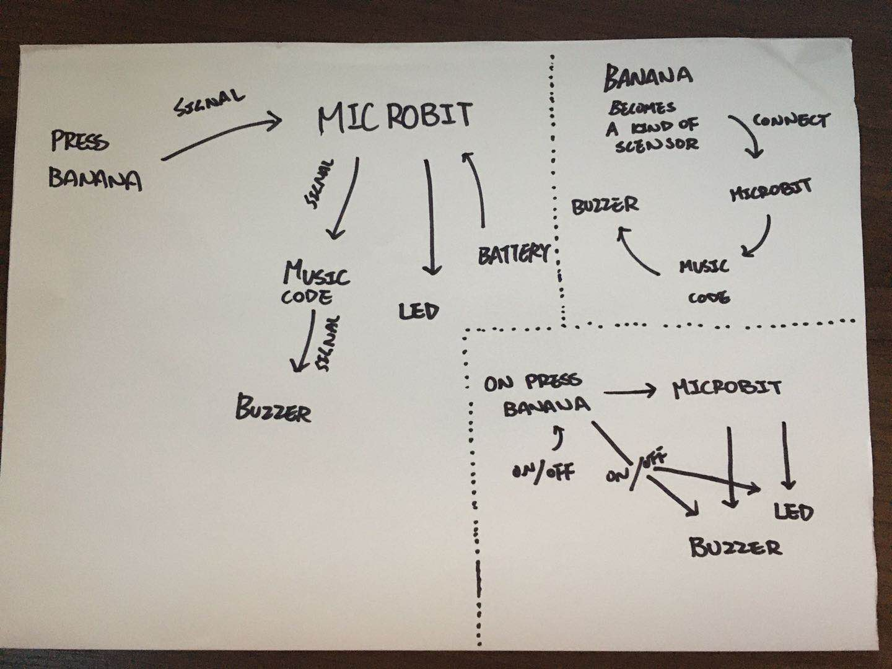
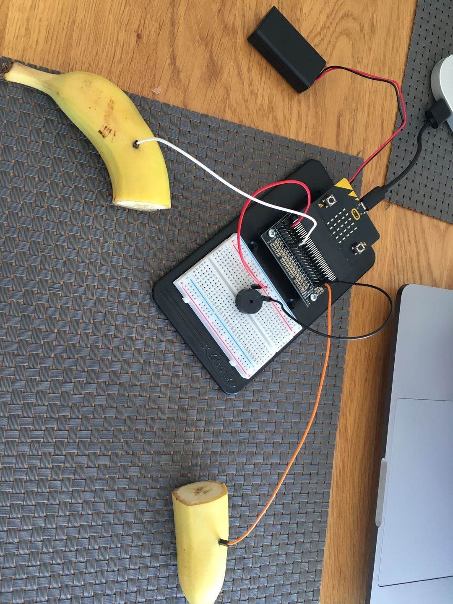
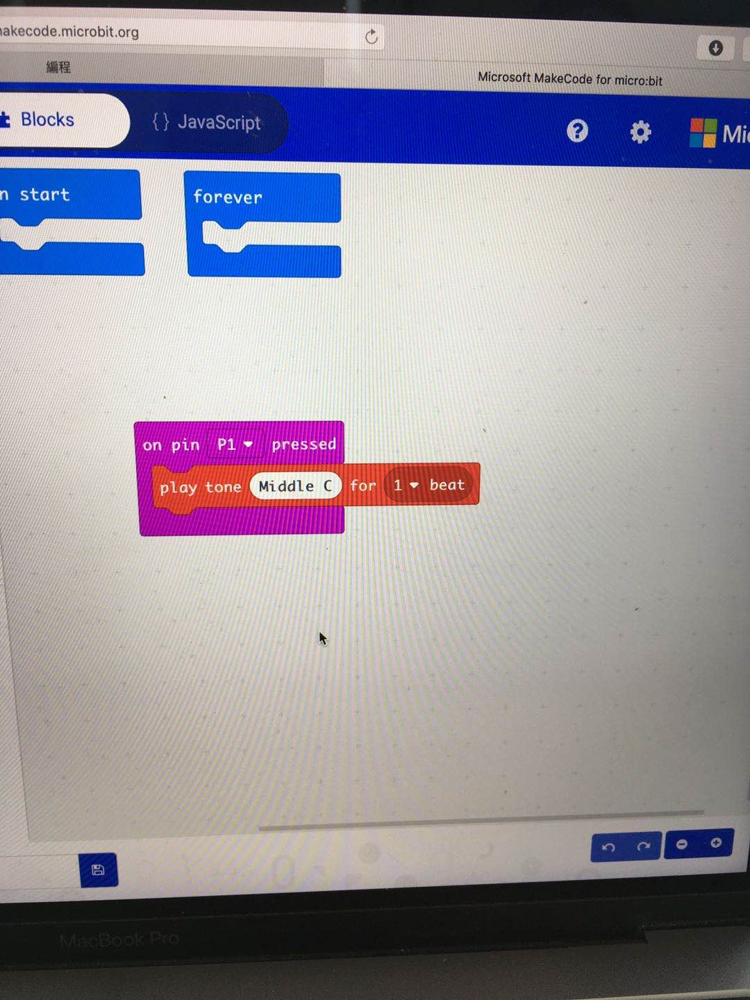
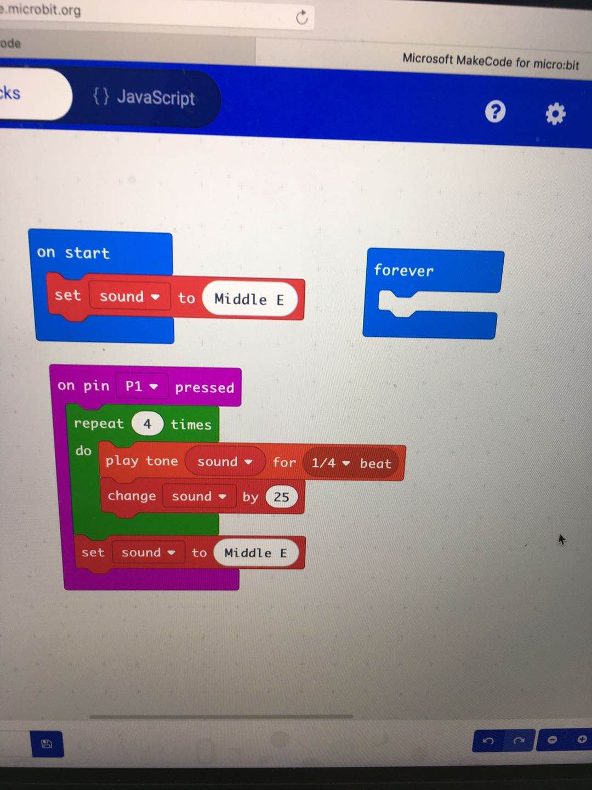
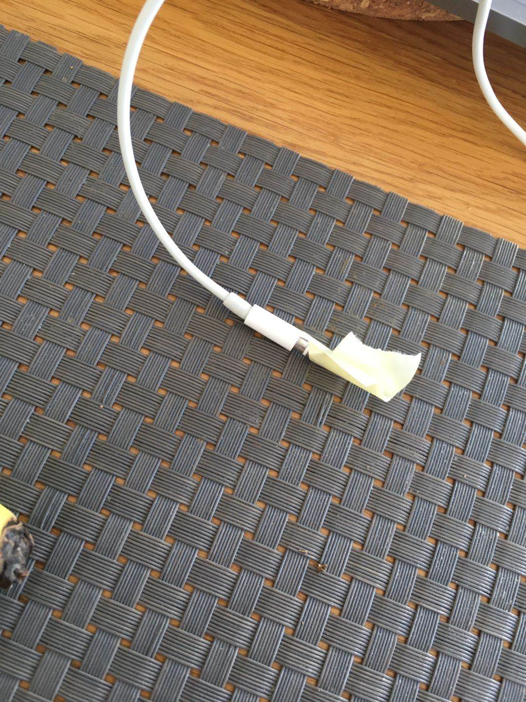
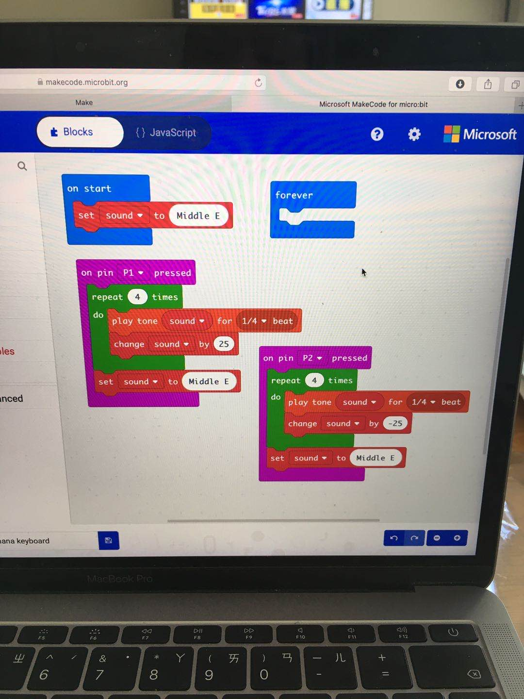
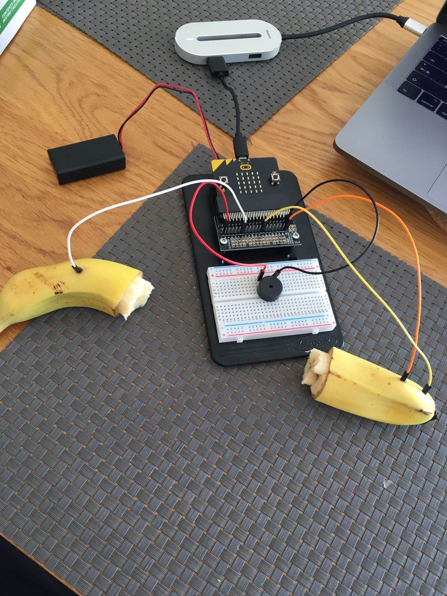

# Assessment 1: Replication project

## Replication project choice ##
The project I have chosen to replicate is the Banana Keyboard

## Related projects ##

### Related project 1 ###
Playing Videogames with a Banana Keyboard

https://www.youtube.com/watch?v=srWDRWrSHZM&t=41s

This project is related to mine because we were both using Banana as our Keyboard but just with different purpose, the concept is the same, but in the video, his is more complicated than my.

### Related project 2 ###
Fruit Keyboard

https://www.youtube.com/watch?v=B2esj9-7RU4

This project is related to mine is becasue we were both using "fruits" as keyboards to make music, but comparing mine to this project, there were more variety of fruits used in the project compared to mine, but the idea and the concept were both the same, both were about using fruits as keyboards to make music.

### Related project 3 ###
Glowing LED with Lemon

https://www.youtube.com/watch?v=AWEdpTOtL6M

The reason this project is realted to my project is because in this project, he is also using "fruit" to create a electrical circuit, but instead using the lemon to become a keyboard and make music with it, this project uses lemon as a source of electricity, and the electricity of four lemon comboned generated enough electricity to successfuly light up the LED.

### Related project 4 ###
Hand Wired Keyboard

https://www.youtube.com/watch?v=zY2k75eWrLQ

This project is realted to mine is becasue the two of our project were basically sharing the same concept, when the key on the keyboard is pressed down, it sends a message to the center in this case the computer, than letters comes out or actions made, and this is the same with my project, as when the banana is pressed, it sends a signal/message to the microbit to trigger the code to make music. The Hand Wired Keyboard project is like a more complicated and professional version of a Banana keyboard, considering the two basically does the samething in sending message to the control center to trigger actions as what they are coded to do.

### Related project 5 ###
Interactive LED Floor

https://www.youtube.com/watch?v=g6N9Qid8Tqs&list=PLUFYSjzJt4pSAkPLRojNrTt6ZOVkDmI2_

This project is related to mine is becasue I believe that we have used the same concept in our projects, with the LED Floor project, the movement of "colors" are triggered when someone steps on it and walks on it, it is technically the same as the Banana Keyboard, as on press music comes out. With the LED Floor, they could be using a motion scensor, touch screen type or the same as the Banana keyboard "on press", therefore when something is detected, it triggers the code to make LED colors to follow the motion. The concept is likly to be the same, but the LED Floor project is definitely more challenging to create and more time consuming. 

### Related project 6 ###
What the Future of Art Will Look Like

https://www.youtube.com/watch?v=ECZbW2jcPcw

This project is related to my project is becasue I believe we share the same concept, and this project is also really similar to the LED Floor project mentioned in the previous related project, but this time this project used more like a touch screen type of thing to create his project, this is different with the Banana Keyboard as we will need to press, and this project only requires touch, but the concept and coding could still be similar and touching triggers the code to send the message to the screen the make difference/movement when the user is touching the screen. This is similar to the Banana Keyboard as it also required actions to trigger the code the send a message to the center computer(microbit), but in our case we dont make screen movements but music. 

## Reading reflections ##

### Reading: Don Norman, The Design of Everyday Things, Chapter 1 (The Psychopathology of Everyday Things) ###

*What I thought before: Actually having to read some part of this book in other courses was very interesting, as Don Norman was well- known for the problems he has with "Doors", and it became so well known that people started calling proble doors the "Norman Doors", before reading this book and hearing the name "Norman Door", I thought it was a kind of design for doors, but i was wrong, it means doors that were designed wrong or not used for what it is designed for.  

*What I learned: After reading this Chapter and other parts of the book, I have learned that "user experience" are very important, and as we are mainly creating things for people to use, Human Centered Design is an important part we need to think about, a "good" design is often hard to notice compare to the "bad" designs, as "good" designs blend in to our daily lives so well that we don't even notice it. Also the book mentions that often simple designs are the most confusing, it is important for us to do research, understand it before creating it.

*What I would like to know more about: What I would like to know more about is how can we connect and seperate "spaces" without the use of door ?, this sounds like a simple question but yet also very complicated to come up with a solution.

*How this relates to the project I am working on: The book makes me think more about the "design concept" for my project, as if I was to design something that is "user based" it is important for me to understand "Human Cebtered Design" to have the best outcome for my project.

### Reading: Chapter 1 of Dan Saffer, Microinteractions: Designing with Details, Chapter 1 ###

*What I thought before: Before reading this source, I had no idea that Microinteractions were such a big thing, and had such a large part in our daily lives, also the impact on the technology we have today compare to the past, it is advancing at a really fast pace and the future of it is limitless.

*What I learned: From readig the source, I have learned that Microinteraction are actually all around us, it is in our daily lives, and it is nearly impossible to live without them now as they stand a really important part for our daily lives to function. What may seem impossible now can and could be accomplish in the future, as in the past, the technology we have in present days didn't exist, therefore that Microinteraction really stand a important part in our lives and also our future.

*What I would like to know more about: What will the Microinteraction future be like in 10 to 20 years or even further?

*How this relates to the project I am working on: The realtion of the reading with my project is that Microinteractions were used in both of them, as Banana Keyboard is a more simple version of an actual keyboard that shares the same concept, they both sends a signal to an Microbit(computer) which will trigger the code to do what they are designed to do, the reading talkes about Microinteraction, and using a microbit to make a Nanana keyboard is also an interaction with Micro. Microinteraction is everywhere in our lives, our phones, computer...etc. Banana Keyboard is just a simple project and a samll part of the big "Microinteraction" thing around the world.  

### Reading: Scott Sullivan, Prototyping Interactive Objects ###

*What I thought before: Before reading this source, I didn't know that coding will become so important in "design" in the future as the source state it, but after reading it, it is for me to believe that coding will become an important part of the design future and also a needed ability for an designer in the future.

*What I learned: With the large possible opportunity for design in the future, as customers expectations have grown to a point that they are no longer just looking for "designs" but looking for advanced digital functions in their off screen lives, with the advance of technologies around the presnet world, it is not hard to imagine how advance the technology could be in the future, and it is a job for designers to help the people to emerge into the future and the provide them solutions to the problems in their daily lives, knowing how to code as a designer in the future is an important ability as most of our daily life function is already depending on technology in present days, technologies will only become better and more advanced, it is the job for designers to adapt and emerge with the future.

*What I would like to know more about: With the advancing of technologies, where do we see "Design" in the next 20 to 50 years? 

*How this relates to the project I am working on: Creative thinking is a important part for a designer as we are suppose to be solving problems in the present and the future, Banana Keyboard is a craetive thoguht by using Banana as keyboards to create music. As the reading states that coding will be important in the future, this is what we are building up now, starting simple but yet not too simple, Banana Keyboard's coding is simple, but it is not as simple as it looks as we need to understand the code itself. The reading explains the reason why coding will be important in the future, and this is what my project is about, coding and creating. 

## Interaction flowchart ##
To consider a user might use this to do what I didn't make this project for, the whole things wouldn't really work if you take the "Banana" away from the whole device, as the banana was the "trigger" to all the codes. Yes you can replace the banana with other fruits but that wouldn't change the whoel device, it will just change the fruit. The only thing I could think of that this device could be used which was no my intend was to annoy people with the buzzer, to create mess, waste fruit. There are no danger in this project as the batteries would not create enought voltage to electrocute people/user, the only danger in the project could be the jumper wires, as they have a sharp point at the end of each of them, it could be dangers when not used with care and could cause injuries but nothing major that could harm life. 

## Process documentation

This is the very first attempt with the project, after having to build the Banana Keyboard and sending the code done to the microbit, testing the final outcome is what needed to be done, and it works fine as i press the banana the music comes out, the first attempt was a success.

After the first attempt, I went further into the tutorial and created the more complicated code for the project.

## Project outcome ##

*Complete the following information.*

### Project title ###

### Project description ###

*In a few sentences, describe what the project is and does, who it is for, and a typical use case.*

### Showcase image ###

*Try to capture the image as if it were in a portfolio, sales material, or project proposal. The project isn't likely to be something that finished, but practice making images that capture the project in that style.*

### Additional view ###

*Provide some other image that gives a viewer a different perspective on the project such as more about how it functions, the project in use, or something else.*

### Reflection ###

*Describe the parts of your project you felt were most successful and the parts that could have done with improvement, whether in terms of outcome, process, or understanding.*

*What techniques, approaches, skills, or information did you find useful from other sources (such as the related projects you identified earlier)?*

*What ideas have you read, heard, or seen that informed your thinking on this project? (Provide references.)*

*What might be an interesting extension of this project? In what other contexts might this project be used?*
